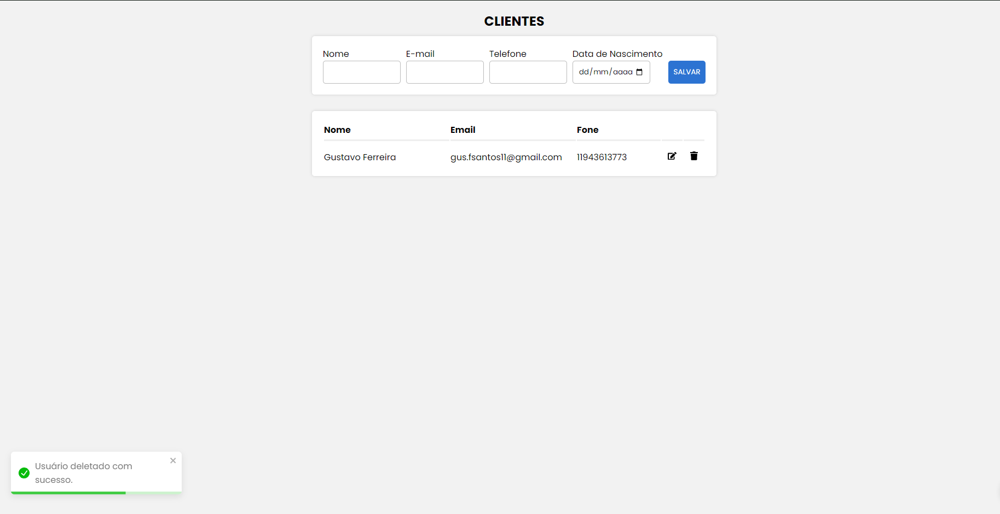

<h1 align="center"> CRUD de Clientes </h1>

CRUD com React, Node.js, JavaScript, utilizando MySQL.  

 

  

## 🚀 Tecnologias

Esse projeto foi desenvolvido com as seguintes tecnologias:

- React
- Node.js
- JavaScript
- MySQL
- Git e Github

## 💻 Projeto

O CRUD de clientes, é um website que armazena ID (de forma automática), Nome, Email e Data de Nasciemnto do Cliente, e tem funcionalidades de GET, POST, DELETE e PUT. Onde foi utilizado React como framework, com o próposito de conhecer melhor a ferramenta, foi meu primeiro projeto usando React e MySQL.